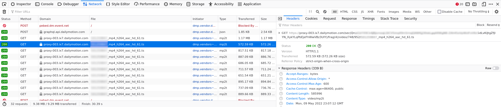

# TS Video Downloader

## Introduction

Many websites stream their videos using the **MPEG Transport Stream** (TS) format ([see wikipedia](https://en.wikipedia.org/wiki/MPEG_transport_stream)).

This is a series of TS files that are requested every few seconds by your browser.  Usually, a sequence number is found in the url in order to get the chunks in order.  For example:

```
https://video.domain.com/chunk1.ts
https://video.domain.com/chunk2.ts
https://video.domain.com/chunk3.ts
...
```

The script `ts_downloader.py` will just download all the TS chunks, concatenate them and convert them to mp4 using `ffmpeg`.


## How to use?

First, find the url of a TS chunk.  To do that, the best way is to open the developer tools (Firefox, Chromium/Chrome), go to the network tab, open a web page with the video you want to download, play it and then look for a request to one or more TS chunks in the requests that show up in the developer pane.

Then identify the counter: since a chunk last only a few seconds, you should see a bunch of requests to TS chunks: by comparing them you will see a number that is incremented.

Here is a screenshot for [lemonde.fr](https://lemonde.fr), which apparently uses [dailymotion.com](https://dailymotion.com) to host their videos:



Here, you see that the counter is `frag(4)`.

Now, replace this counter by `{counter}`. You can add some formatting, like `{counter:05d}`, if necessary.

Run the script:

```
python3 ts_downloader.py -o FILE.mp4 URL_TEMPLATE
```

The script will download all the chunks (it will try to download them by incrementing the counter, until it gets an error, like a 404 (not found)), concatenate them and use `ffmpeg` to convert them into a mp4 file.

Not all web sites will use MPEG Transport Stream (Youtube doesn't, for example, and more specialized web site may use an encrypted version of the technology), but this will do the trick for most of them.

For example, for [jukinmedia](https://www.jukinmedia.com`) you will have to use a template like this:

```
https://f1.cf.brightcove.com/<NUMBERS>/<NUMBERS>/<NUMBERS>_s-{counter}.ts?pubId=<NUMBERS>&videoId=<NUMBERS>
```

(where `<NUMBERS>` are a bunch of ids and other arbitrary numbers, just copy them from the requets found in the your browser).

For [kickstarter](https://kickstarter.com), you will need to set a format:

```
https://v.kickstarter.com/<NUMBERS>/projects/<NUMBERS>/video-<ID>-hls_720-{counter:05d}.ts
```

For [lemonde](https://lemonde.fr):

```
https://proxy-003.ix7.dailymotion.com/sec(<ID>)/frag({counter})/video/<NUMBERS>/<NUMBERS>/<NUMBERS>_mp4_h264_aac_hd_61.ts
```

etc.


## Dependencies

`ffmpeg` to convert the concatenated TS chunks into a valid a mp4 file.


## Author

Bruno Oberle, 2022

Contact me at https://boberle.com
